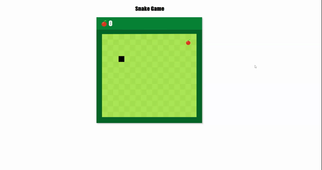

# SnakeGame
This project aims to create the snake game with JavaScript Canvas.

The snake moves with the arrow keys, the sounds become active as it progresses and eats the apple. The score increases as the snake eats the apple.
The game is over when the snake hits the sides of the box or hits itself. When the game is over, dragon gifs and "game over" warning will appear.

# Demo
